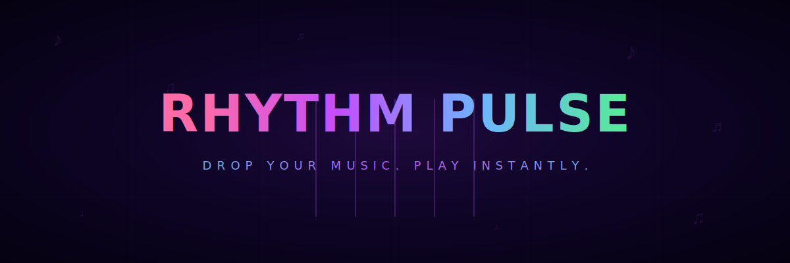

  

  
  
  

Drop any music file and start playing in seconds. No install, no signup, no setup.

---

## 🎮 What is Rhythm Pulse?

A browser-based rhythm game that auto-generates beat-matched charts from your own music. Drag in an MP3, and it detects the BPM, generates 4 difficulties, and throws you into gameplay instantly — like osu!mania meets FNF, but with your songs.

## Why it's cool

- **Your music, your charts** — drop any song, get instant beat-synced gameplay
- **760 achievements** with sound effects and in-game popups
- **Online leaderboards** — compete globally and claim your rank
- **Share songs** — play others' songs directly from the leaderboard
- **Works offline** — songs save forever in your browser
- **Single HTML file** — zero dependencies, runs anywhere
- **Mobile touch support** — play on your phone with on-screen lanes

## 🔥 Features at a glance

### 🎮 Gameplay
- **4K–8K lanes** — customize your layout
- **Downscroll or Upscroll** — your preference
- **4 difficulties** per song (Easy → Insane)
- **Modifiers** — Mirror, Random, Hidden, Sudden
- **Practice mode** with speed control, loop, and minimap
- **Autoplay & Metronome** for learning
- **Hold notes** with press-and-release judgment

### 🎨 Visuals
- **Beat-reactive zoom** — the screen pulses with the music (FNF-style)
- **Radial visualizer** — 4-way mirrored spectrum with side dimming
- **Combo effects** — screen shakes, particle trails, lane glow
- **Multiple color schemes & note styles** — make it yours
- **Key press FX** — satisfying visual feedback on every hit

### 🎵 Your Music Library
- **Drag & drop** any audio file
- **Built-in music browser** — search and download from Audius (free & legal)
- **Free music sources** — links to NCS, Pixabay, Incompetech, and more
- **Auto BPM detection** with autocorrelation for accurate charts
- **Smart chart generation** — 4 difficulty levels from one detection
- **Media player** — prev/next, loop, shuffle, seek, volume
- **Favorites & sorting** — organize by name, BPM, or length
- **Regenerate charts** — re-detect BPM and rebuild on demand
- **Export/Import** individual songs or full library backups

### 🏆 Progression & Community
- **760 achievements** — progressive unlocks with cumulative stats
- **Global leaderboards** — Overall (combined best) and Per-Song views
- **Song sharing** — auto-upload your songs to cloud, download others'
- **Grades** (S/A/B/C/D/F) with detailed timing graph
- **Copy score to clipboard** — flex on your friends
- **Save codes** — transfer settings between devices

## ⌨ Controls

| Mode | Keys |
|------|------|
| **4K** | `D` `F` `J` `K` |
| **5K** | `D` `F` `Space` `J` `K` |
| **6K** | `S` `D` `F` `J` `K` `L` |
| **7K** | `S` `D` `F` `Space` `J` `K` `L` |
| **8K** | `S` `D` `F` `Space` `J` `K` `L` `;` |

> Hold notes require sustained key press — judgment on release.

## 📊 Judgments & Scoring

| Judgment | Window | Points |
|----------|--------|--------|
| ✨ **Marvelous** | ±22ms | 350 |
| 💎 **Perfect** | ±45ms | 300 |
| 🟢 **Great** | ±90ms | 200 |
| 🔵 **Good** | ±135ms | 100 |
| 🔴 **Miss** | ±180ms | 0 |

Combo multiplier ramps up to **×4** at 50+ combo.

## 🎵 Free Music Sources

All copyright-free or permissive license:

| Source | License | Best for |
|--------|---------|----------|
| [**NCS**](https://ncs.io) | Free (credit) | Electronic, strong beats for rhythm games |
| [**Pixabay Music**](https://pixabay.com/music/) | No attribution | Broad genres, safe pick |
| [**Incompetech**](https://incompetech.com/) | CC BY | Kevin MacLeod's massive collection |
| [**OpenGameArt**](https://opengameart.org) | CC / CC0 | Game-focused tracks |
| [**Free Music Archive**](https://freemusicarchive.org) | Mixed | Curated, filterable |
| [**YouTube Audio Library**](https://www.youtube.com/audiolibrary) | Free | No-attribution filter available |

## 📁 What's in the box

- **`index.html`** — the entire game (open and play)
- **`sw.js`** — service worker for offline caching
- **`banner.svg`** — the repo banner you see above

## 💡 Coming soon

Ideas on the horizon — hop on [Discord](https://discord.gg/aa83vhpC4v) to vote or suggest:

- [ ] Chart editor for manual note placement
- [ ] Replay system (watch past gameplay)
- [ ] Custom skins & themes
- [ ] Multiplayer / co-op
- [ ] Story mode with progression

## 🛠 Built with

Vanilla JS, Web Audio API, Canvas API, IndexedDB, Service Workers, Audius API, Supabase — **zero frameworks, zero build step**.

## 📜 License

MIT — go wild.

  
  

